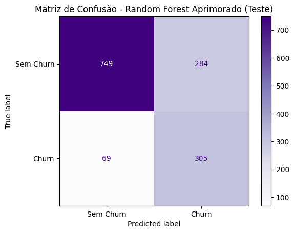

# Projeto de machine learning para detecção de churn em uma empresa de telecom

Este projeto surgiu de um curso em parceria da Oracle, Clearsale e Alura. Consiste em uma análise exploratória de dados (_EDA_) de churn de clientes em uma empresa de telecom e um projeto de machine learning para prever clientes que irão evadir da empresa. O objetivo deste trabalho é identificar atributos que possam estar influenciando na alta do churn desta empresa e realizar treino e teste de modelos de machine learning para detecção do churn.
Toda análise se dá utilizando a linguagem python em um notebook do google colab.

Neste [link](https://colab.research.google.com/drive/1zva3Sl3HGKHBYy42pT-zGiTHWHyuZqH2?usp=sharing), você poderá ver o projeto e interagir com gráficos gerados por meio da biblioteca plotly.

Já por este [link](https://github.com/fellipe753/eda_churn_telecom/blob/main/telecom_churn.ipynb), você poderá ver o projeto sem os gráficos da plotly que não são compatíveis com o github.

## Etapas:
* Importação dos dados e biblioteca;
* Tratativa dos dados;
* Análise das principais variáveis;
* Preparação dos dados para serem usados em modelos de machine learning;
* Construção de modelo base para comparação;
* Treino de 4 modelos e métricas de sucesso;
* Aprimoramento dos modelos;
* Validação do modelo com dados de teste;
* Relatório com conclusão e insights.

## Resultados
Após testar milhares de combinações, é apresentado a melhor combinação de cada um dos tipos de modelos. Os modelos de RandomForest, Logistic Regression e XGBoost ficaram muito próximos nos resultados, sendo mais equilibrados entre `recall`e `precision`. Já o DecisionTree teve o melhor `recall`, identificando aproximadamente 89% dos churns. Entretanto, ele é o que mais sofre com falsos positivos.

Cabe a empresa decidir qual destes modelos escolher. Caso o custo de falsos positivos não seja problema, o DecisionTree será a melhor escolha, caso contrário pode optar por um dos outros 3.

| Métrica     | DecisionTree | RandomForest | LogisticRegression | XGBoost | Descrição                                                                 |
|-------------|--------------|---------------|---------------------|---------|---------------------------------------------------------------------------|
| Recall      | **0.8877**      | 0.8155        | 0.8128              | 0.8182  | Proporção de clientes que realmente saíram (churn) e foram corretamente identificados. Alta sensibilidade. |
| Precisão    | 0.4262       | 0.5178        | 0.5179              | 0.4896  | Proporção de previsões de churn que estavam corretas. Alta precisão significa menos falsos positivos.       |
| Acurácia    | 0.6525       | 0.7491        | 0.7491              | 0.7249  | Proporção total de acertos (churn e não churn) entre todas as previsões.                                     |
| F1-Score    | 0.5759       | **0.6334**        | 0.6327              | 0.6126  | Média harmônica entre precisão e recall. Mede o equilíbrio entre detectar churn e evitar falsos positivos.  |

Abaixo é ilustrada a matriz de confusão do modelo RandomForest aprimorado:
*   Verdadeiros positivos: (749) O modelo previu “sem churn” e o cliente realmente ficou.
*   Falsos positivos: (284) O modelo previu “vai sair”, mas o cliente ficou. Isso pode gerar custo desnecessário, como dar desconto para quem não ia sair.
*   Falsos negativos: (69) O modelo previu “vai ficar”, mas o cliente saiu.
*   Verdadeiros positivos: (305) O modelo previu “vai sair” e o cliente realmente saiu.

  

## Ações a serem tomadas visando a redução do churn
Baseado nos resultados e nas variáveis usadas, a empresa pode buscar formas de fidelizar o cliente, garantindo que eles possuam contratos mais longos ao invés de mensais. Essa é uma ação bem comum em empresas de telecom, onde é possível ofertar preços melhores ou produtos agregados para contratos mais longos.

Outro ponto imporante, é que o tipo de internet "fibra ótica" se mostrou importante na decisão dos clientes evadirem. Esse tipo de tecnologia é geralmente muito rápida e robusta, mas nesse caso pode mostrar que existe algum problema, seja de capacidade de rede, excessivas quedas ou interrupções longas. A empresa, junto com a equipe técnica e engenharia de capacidade pode avaliar melhor caso, cruzando com reclamações de clientes para detectarem a causa raiz.

Quanto ao modelo a ser usado, vai depender se a empresa busca um número maior de acertos no churn sem se preocupar com os falsos positivos, ou se preferem ter um balanceamento entre entre esses dois números. Campanhas para evitar o churn podem ser custosas e a empresa precisa se planejar bem para esta ação.

  

